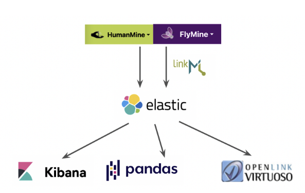
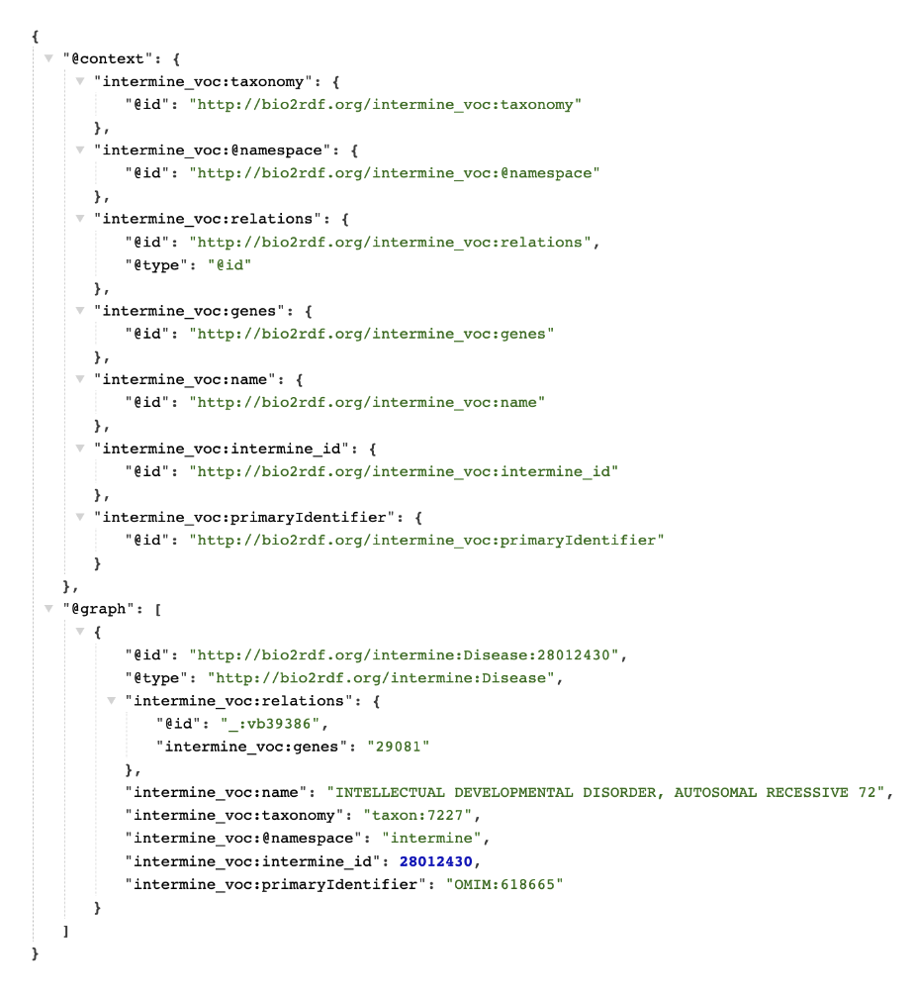
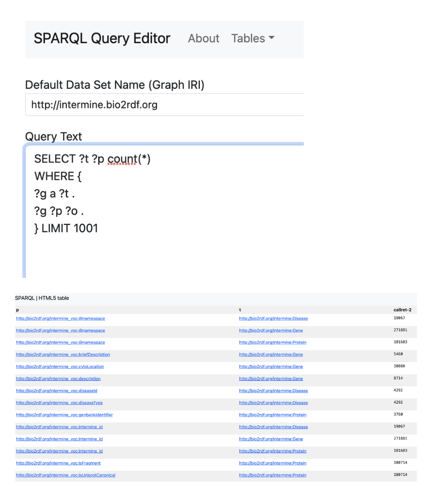
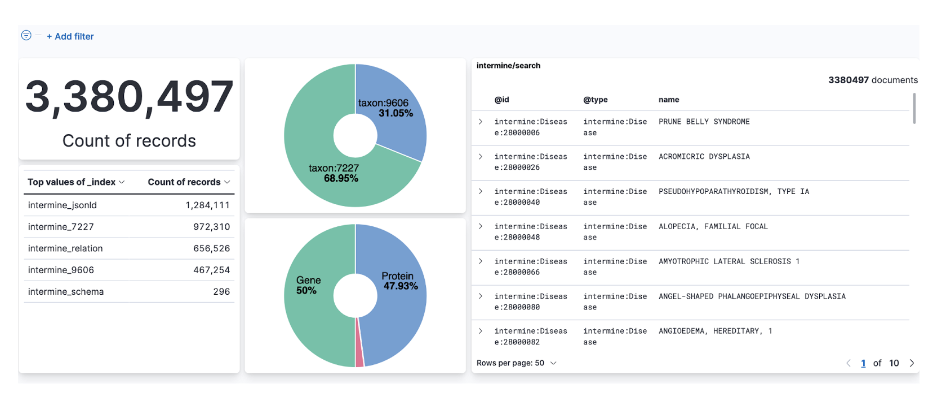
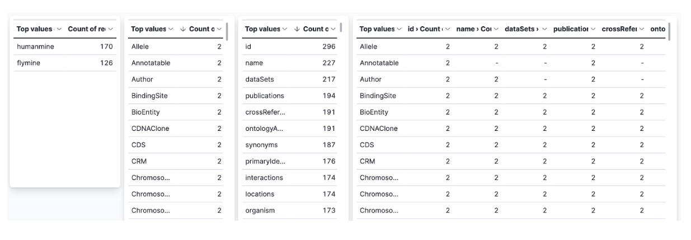

# Introduction

[InterMine](www.intermine.org) [1] is an open source data warehouse system that can be used to create biological databases that can be accessed via web query tools. There are many public InterMine instances ([registry](https://registry.intermine.org)) that are currently deployed worldwide and they share a core data model pertaining to common biological entities. Besides the core data model, each instance of InterMine typically has an extended data model to cover data specific to that particular deployment. The data is organised according to the graph-based data model but exists in a relational store (Postgres). The goal of this project was to explore the possibility of translating InterMine data from relational form to a graph form using Resource Description Framework (RDF) as the exchange format (See Figure 1 for an overview). This could provide a route to exposing data from InterMine instances as RDF triples and thus making it possible to query the data using the SPARQL Protocol and RDF Querying Language (SPARQL). Additionally, to enhance queryability and analytics on the InterMine data, we also explore the possibility of loading the RDF data (or rather a transformed version) into a document store like Elasticsearch.




**Figure 1:** Overview of workflow. The data models from HumanMine and FlyMine were extracted in JSON and converted to LinkML YAML. JSON data for objects from the Gene, Protein and Disease classes were converted to RDF-compliant JSON-LD and loaded into Elasticsearch.  This enabled data exploration and analysis using Kibana and Pandas, as well as facilitating conversion to triples that were loaded into Virtuoso.


# Results

We started by first translating the data model from two well-known InterMine instances, [HumanMine](www.humanmine.org) and [FlyMine](www.flymine.org). The data model for both of these can be fetched as JSON via their respective APIs as follows,

```shell
curl https://www.humanmine.org/humanmine/service/model?format=json \
    > humanmine_model.json
curl https://www.flymine.org/flymine/service/model?format=json \
    > flymine_model.json
```

To express the data model of HumanMine and FlyMine, we looked into [LinkML](www.linkml.org) [2], a flexible modeling language that allows one to define data models in YAML while providing several constructs that can be used for expressing the complexity of a data model. We translated the HumanMine and FlyMine data model into LinkML YAML, where classes are defined as [LinkML classes](https://linkml.io/linkml-model/latest/docs/ClassDefinition/) and class properties are defined as [LinkML slots](https://linkml.io/linkml-model/latest/docs/SlotDefinition/).

To facilitate this translation, a Python script ([intermine2linkml.py](https://github.com/intermineorg/intermine2sparql/blob/main/intermine2linkml.py)) was written to translate the JSON describing the HumanMine and FlyMine schema into LinkML YAML. These YAML representations were used as the source of truth for preparing and loading HumanMine and FlyMine data into [Elasticsearch](https://www.elastic.co).

As a proof of concept, we concentrated on three relevant classes from the core InterMine data model: Gene, Protein and Disease. In addition, we also focus on relationships between genes and proteins as well as genes and diseases. We utilize the InterMine API of HumanMine and FlyMine to extract JSON data corresponding to these types. After fetching the JSON data, we convert it into key-value pairs (i.e. flatten the representation of the data). This was then enhanced to conform to JSON-LD by adding `@id`, `@type` and `@context` fields.

At this point we had one set of documents describing the members of the different classes (like Gene, Protein, Disease) and another set describing the relationships between members of these classes. These documents were merged by adding a list of relationships at the end of each object description document. In this way we obtained properties and their relationships in the same document, describing each object in JSON-LD format (See Figure 2).





**Figure 2:** An example of the JSON-LD that was generated.

For loading data into Elasticsearch, we prepared Jupyter notebooks that do the following:

- [schema2es.ipynb](https://github.com/intermineorg/intermine2sparql/blob/main/schema2es.ipynb): First we converted the schema and loaded it into Elasticsearch
- [intermine2es.ipynb](https://github.com/intermineorg/intermine2sparql/blob/main/intermine2es.ipynb): After which, we converted the JSON data and loaded them into Elasticsearch
- [intermine_relation2es.ipynb](https://github.com/intermineorg/intermine2sparql/blob/main/intermine_relation2es.ipynb): Finally, relationships between objects were loaded into Elasticsearch

The final step was to transform the JSON-LD from Elasticsearch to triples in N-Triples (`*.nt`) format. To do so, we used the [RDFlib](https://rdflib.readthedocs.io/en/stable) Python library. To import the resulting triples into Virtuoso, a SPARQL UPDATE query was used.




**Figure 3:** an example SPARQL query run over InterMine data in Virtuoso and the resulting output.

In total 46 million JSON-LD documents describing objects and 260 million JSON-LD documents describing the relationships between objects were loaded into Elasticsearch. The conversion of JSON-LD into RDF triples resulted in ~600 million triples which was then loaded into Virtuoso. Once the triple store was loaded, this opened the possibility to run SPARQL queries over the InterMine RDF data (see Figure 3).




**Figure 4:** Kibana running over the data in Elasticsearch was used to summarise the number of records from each database, including by taxon, and to allow the documents to be browsed.

There were other benefits from the above workflow: loading the InterMine data into Elasticsearch made it straightforward to carry out data analysis using [Kibana](https://www.elastic.co/kibana). For instance we were able to summarise the number of records from each database, including by taxon, and to allow the documents to be browsed (See Figure 4), as well as to summarise and compare the classes present in HumanMine and FlyMine (See Figure 5). 




**Figure 5:** The classes present in HumanMine and FlyMine were summarised and compared using Kibana.

Similarly, we could carry out analysis with [Pandas](https://pandas.pydata.org) data frames running within [Google Collab](https://colab.research.google.com). We were able to use the Pandas merge function in parallel with merging via SPARQL query. Being able to merge in two ways allowed us to check that the same results were obtained.


# Discussion and Conclusions

This study demonstrated the feasibility of moving data in bulk from multiple InterMine instances, integrating it in a single Elasticsearch and then pushing the data into a triple store, in this case Virtuoso. 

It also demonstrated that more work is needed on the core InterMine data model in order to identify and store appropriate predicates corresponding to the relationships between objects. For instance these could be sourced from the [Relations Ontology](https://www.ebi.ac.uk/ols/ontologies/ro), [Biolink Model](https://biolink.github.io/biolink-model) and elsewhere as needed via the [OLS](https://www.ebi.ac.uk/ols/index) and [BioPortal](https://bioportal.bioontology.org). In this way it should be possible to express InterMine schemas more completely in LinkML and enable more effective export of semantic data from InterMine databases.

This workflow also provides an outline for a possible future version of InterMine, with core functionality provided by a suite of related Apache open-source tools, perhaps feeding a triple store, rather than custom-written code. The benefits of this approach would include the large support communities, the ability to analyse data in real time during loading and options for parallelisation. 

Further consideration is needed of what parts of the current InterMine functionality would have to be added (e.g. lists, templates, automatic code generation) to Elasticsearch and a triple store in order to make this a reality. Also, it would be necessary to consult with the InterMine community about implementation. In principle it would be possible to adapt the current InterMine user interface, [BlueGenes](https://github.com/intermine/bluegenes) to generate queries in Elasticsearch DSL and/or SPARQL, rather than the current InterMine Query Language. This would enable BlueGenes to operate over a number of different backends. In addition, it would be worth adapting this project to use [Opensearch](https://opensearch.org/) instead of Elasticsearch as Opensearch has a more permissive licence.

InterMine templates provide fill-in-the blank query examples that exercise common search tasks and act as starting points for more complex queries. Such queries can correspond to ShEx or SHACL shapes, and proof-of-concept tools exist that, given such shapes, are able to generate the corresponding web pages with slots for values, though a mechanism would need to be added to accommodate the accompanying explanatory text that templates provide. Templates can act as contracts to supply data to external code and ShEx and SHACL could carry out this role. A good example of such contracts would be interfaces with [Togo Stanzas](http://togostanza.org) tools, which could be used for visualisation and analysis.

This also provides a way for current InterMine instances to expose their instances in RDF and thus being able to participate within the broader Linked Open Data community while being able to leverage existing resources and expertise.

The work described is available via the [intermine2sparql](https://github.com/intermineorg/intermine2sparql/) repository.


# Acknowledgements

We are grateful to the organisers of the DBCLS BioHackathon 2023 for travel, accommodation and hackathon support for most of the authors, and for organising a very enjoyable and productive hackathon.


## References

1. Smith, R. N., Aleksic, J., Butano, D., Carr, A., Contrino, S., Hu, F., Lyne, M., Lyne, R., Kalderimis, A., Rutherford, K., Stepan, R., Sullivan, J., Wakeling, M., Watkins, X., & Micklem, G. (2012). InterMine: a flexible data warehouse system for the integration and analysis of heterogeneous biological data. Bioinformatics (Oxford, England), 28(23), 3163–3165.
2. Moxon, S., Solbrig, H., Unni, D., Jiao, D., Bruskiewich, R., Balhoff, J., Vaidya, G., Duncan, W., Hegde, H., Miller, M., Brush, M., Harris, N., Haendel, M., & Mungall, C. (2021). The Linked Data Modeling Language (LinkML): A General-Purpose Data Modeling Framework Grounded in Machine-Readable Semantics. CEUR Workshop Proceedings, 3073, 148-151.

